# Mobile UX/UI Audit — Monopoly Deal Clone

**Date:** 2026-08-25 · **Auditor:** Claude (expert game-UX pass) + 3 parallel audit agents
**Device profile:** 390×844 portrait (iPhone 14-class), DPR 2, touch; sweeps at 320×568, 414×896, and 844×390 landscape
**Scope:** Home, networked lobby, `/local` pass-and-play (played as an actual player through property plays, banking, action cards, payments, steals, discard-excess), networked 2-player game, measurable-quality pass (tap targets, contrast, overflow, console)
**Note:** Findings only — no fixes applied. Screenshots in [`screenshots/`](screenshots/) (117 files: lead `01–24`, agents `a-*`, `b-*`, `c-*`).

**Suggested fix order for tomorrow:** the four blockers first (E1 stuck-turn is the scariest; A1 seat switching unblocks all local mobile testing), then the "silent state change" cluster (B8, E3, E4, B11), then the legibility cluster (F3, F4, B3), then copy/polish.

---

## Verdict at a glance

The game board reads charmingly on mobile — the card faces are characterful, the layout intent is right, and the core "whose turn / what can I do" loop holds up. But **four blockers stand between this and a shippable phone game**: local seat-switching is keyboard-only on the main screen; a reload silently destroys the local game; a networked turn can wedge on "Cannot end turn with pending interactions" with no recovery; and a lost tab locks a player out of their game forever despite a 60 s grace window the server dutifully tracks. Below those sit three systemic themes: **silent state changes** (thefts, auto-pay, auto turn-end resolve with no feedback beyond a badge increment), **copy that leaks internals** (raw card ids, color slugs, seed in the log, the `?? state.you` fallback printing "You" for the wrong person), and **texture over legibility** (69% of card text under 11 px, contrast down to 1.39:1, clipped titles in the hand fan).

| Severity | Count | Where |
|---|---|---|
| Blocker | 4 | A1, A2, E1, E2 |
| Major | 23 | B1–B15, E3–E5, F1–F5 (deduped) |
| Minor | 17 | C1–C14, E6–E9, F6–F8 (deduped) |
| Nit | 12 | D1–D9 + agent nits |
| **Total** | **56 deduplicated findings** | |

---

## A. Blockers

### A1. Local pass-and-play cannot switch seats by touch on the game screen
The only on-board seat switcher is physical keyboard keys 1–4 ([LocalGameApp.tsx:78-82](../apps/web/src/LocalGameApp.tsx#L78-L82)). Touch seat buttons exist, but hidden inside the **Table Feed drawer**, under a dev-style "YOUR SEAT … Keys 1–4" block no player would open mid-game. On a phone, when Priya's turn comes, the screen shows "Priya's turn" and then… nothing can proceed — the game appears frozen (verified: 10+ s idle, no prompt, no hint).
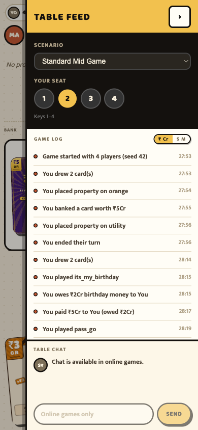

### A2. Reload silently destroys the whole local game
Pull-to-refresh / rotation / back-swipe → full reset to a fresh board, zero warning, no resume. (Also found independently by Agent A: `a-reload2-before.png` / `a-reload2-after.png`.)

---

## B. Major

### B1. Every local game deals the identical hand — hardcoded seed 42, leaked in the log
The player-visible game log's first line: **"Game started with 4 players (seed 42)"**. Two consecutive fresh loads dealt card-for-card identical hands. `/local` boots a "Standard Mid Game" scenario fixture instead of a random deal. Replayability is zero and the seed (supposed to stay secret per project rules) is printed to players.

### B2. FEED pill buries the third opponent's HUD panel
At 320/390/414 px the ☰ FEED button sits **on top of** opponent 3's card — name and avatar unreadable, tap intercepted. Opponent status is core planning info in Monopoly Deal, and nothing else on screen substitutes for it.
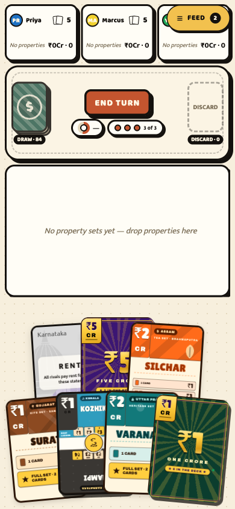

### B3. Hand fan overlap makes your own cards unreadable
Titles routinely clipped: HOTEL→"HOT", HOUSE→"HOU", VARANASI→"VARANA", KOZHIKODE→"KOZHIK", DEAL BREAKER→"DEAL BREA…". You must tap every card to learn what you hold.
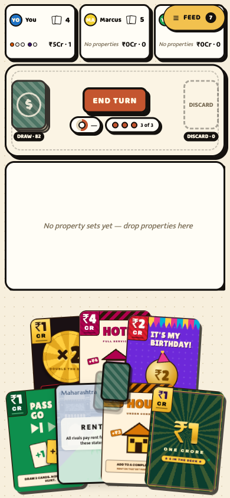

### B4. Hot-seat privacy and identity are absent
Switching seats instantly reveals the next hand — no "pass the phone to X" curtain. Worse, the *previous* seat's full hand stays face-up during another player's turn, and nothing on screen says which seat you're currently viewing.
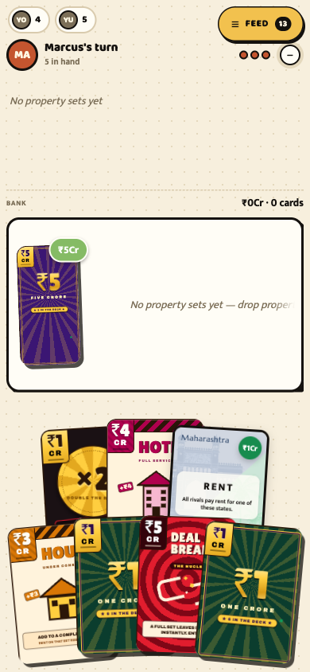

### B5. Action-card play is unlabeled spatial guesswork
Tapping a card silently highlights two zones: your property/bank strip (= bank it as money) and the **discard pile** (= play the action). No "Play" / "Bank" labels anywhere; no first-run hint. "Play my action card by tapping the discard pile" is a mapping no new player will guess.
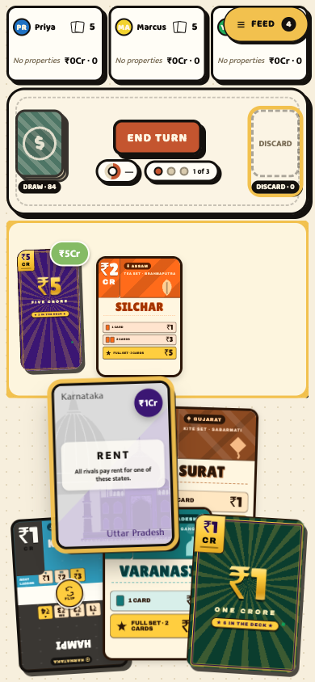

### B6. Unplayable actions dead-end with zero explanation
Hotel with no completed set: every action target just dims. No "needs a full set" message. Player taps, nothing responds, feels broken.
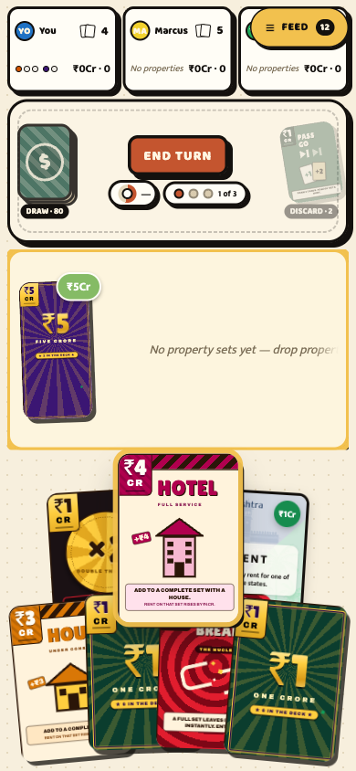

### B7. Sly Deal target sheet has no cancel
DOM verified: no cancel/close/back button exists on the steal sheet. A misclicked Sly Deal forces a theft.
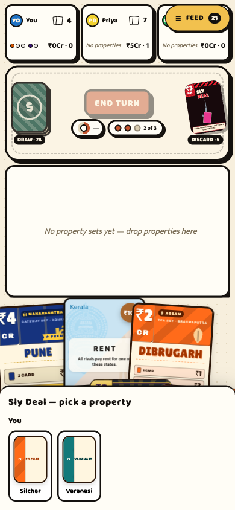

### B8. Theft is silent for the victim
Silchar vanished from my board with no toast, no animation, no banner — only the feed badge ticked up. In a networked game this will read as a bug or cheating.
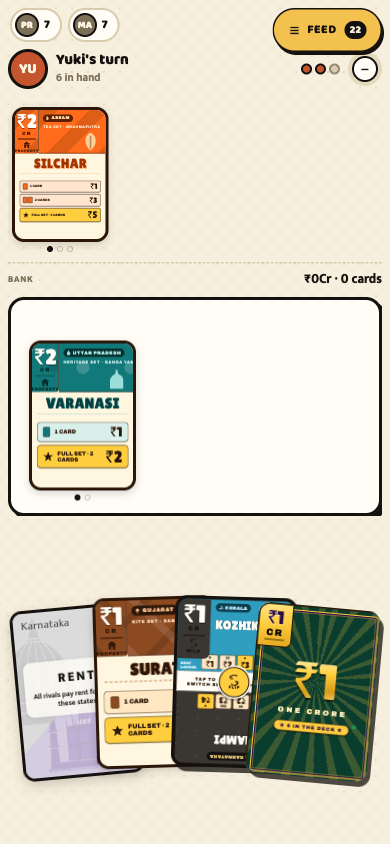

### B9. Payment UX is under-explained on both sides
Payer sheet: card thumbnails render as unreadable rotated slivers; no instruction to select ≥ debt; no overpay/no-change warning before paying ₹5 on a ₹2 debt. Charger sheet: "Waiting on other players / **You selecting payment of ₹2Cr…**" — broken grammar, no per-payer status.
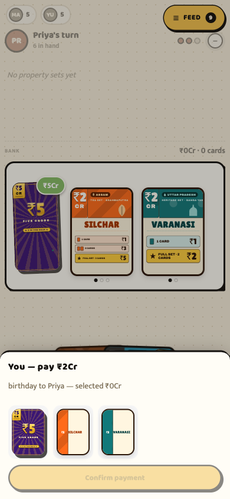
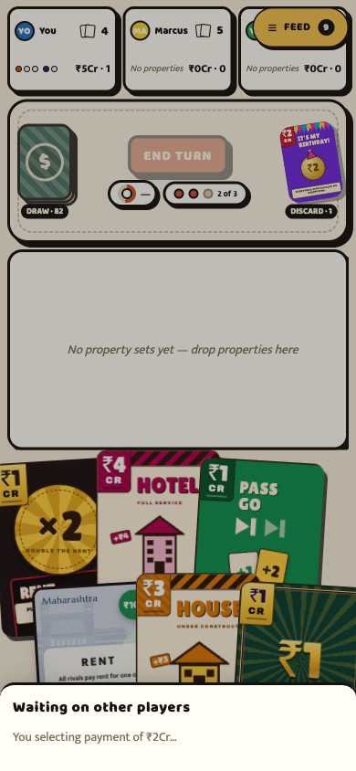

### B10. Log/feed copy leaks internals and breaks grammar
Observed verbatim: "You played **its_my_birthday**" (raw card id) · "**You owes** ₹2Cr birthday money **to You**" · "You paid ₹5Cr **to You**" · "You ended **their** turn" · "You drew 2 **card(s)**" · "placed property on **orange**/**utility**" (internal color slugs instead of the Indian theme's set names). Root cause compounding it: seat 1 is literally *named* "You", so third-person sentences become nonsense.

### B11. Turn auto-ends on the third play with no feedback
The instant play 3 lands, the screen flips to the opponent spotlight — no "turn over" beat, no chance to rearrange/flip wilds first.
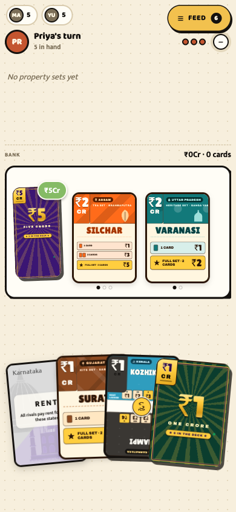

### B12. React duplicate-key errors during normal play
Console: `Encountered two children with the same key, '1'` ×4 during the session — a real risk of duplicated/omitted cards in hand/board lists.

*(From Agent A, networked lobby)* **B13. Room code has no copy button** — sharing the code is the lobby's whole job; only fiddly OS text-selection works (`a-lobby-created-1player.png`, `a-lobby-tap-roomcode.png`). **B14. Landscape FEED drawer slices the board with no scrim** — razor edge cuts cards mid-face, reads as a layout bug (`a-feed-drawer-844x390-landscape.png`). **B15. Dev tooling (scenario picker, seat switcher, seed) in the player-facing feed drawer** (`a-feed-drawer-390x844.png`).

---

## C. Minor

- **C1. Draw pile face shows "$"** while the whole game is ₹ crore themed. And a "₹ Cr | $ M" currency toggle hides in the feed drawer of all places. (02, 19)
- **C2. Plays pill "2 of 3" means "2 remaining"** — reads as "2 used". Meanwhile set-progress dots on property piles also read "1 of 3" (different meaning, same phrasing, same screen). (04, 09)
- **C3. Unlabeled indicators**: mystery "—" pill next to END TURN; opponent spotlight's "—" collapse circle isn't a button role; a hidden 1×1 px label reads "DRAW 2CARD PLAYS" (concatenated words, also "TAP TOSWITCH SET", "2-WAYPROPERTY", "RENTLADDER" in a11y strings). (02, 10)
- **C4. Discard-excess sheet**: "Discard **1 cards**"; sheet docks at the *top* over header/END TURN while the cards to pick sit at the *bottom* (max thumb travel); never says *who* must discard — deadly ambiguity in hot-seat. (20)
- **C5. Interrupt sheets hide the turn banner** — during payment/discard you can't see whose turn it is.
- **C6. Empty-state text clips behind the bank pile** ("…drop pr"). (17)
- **C7. Accessibility**: selected card state not exposed (no aria-pressed/selected); drop zones are plain divs; the whole select-then-tap-zone flow is invisible to a screen reader.
- **C8. Multicolor wild (Joker) auto-joins a set with no placement choice**, then stacks so tightly it visually buries the property under it; "WORTH ₹0 CASH NOTHING" corner text is cramped. (23)
- **C9. Seat 1 is displayed as opponent "You" (avatar "YO")** when viewing other seats — "View You: 0 sets…" aria labels. (13)
- **C10. Feed badge counts every log line** (23 within two rounds) — permanent red-dot noise with no unread semantics. (21)
- *(Agent A)* **C11. Stale "Room not found" error persists** while editing the code (`a-home-short-code.png`); **C12. "Start game (1 players)"** grammar; **C13. Lobby prints raw "Status: lobby"**; **C14. Waiting-for-players state is completely inert** — indistinguishable from a frozen screen (`a-lobby-created-1player.png`).

## D. Nits

- **D1.** Home screen: ~530 px of dead dotted space around a floating form; no hero, art, or tagline — reads placeholder, not game. "Pass & play (local)" — the primary single-device mode — is a 23 px-tall text link beside the title. (01)
- **D2.** Placeholder casing mismatch on one form: "Your name" vs "ROOM CODE". (01)
- **D3.** Display name silently truncates at 24 chars, no counter (Agent A, `a-home-long-name.png`).
- **D4.** 320 px header wraps into a ragged two-line block (Agent A, `a-sweep-home-320x568.png`).
- **D5.** `/cards` dev gallery: fixed 1292 px grid + `overflow-x: hidden` = 2.7 of 4 columns unreachable on mobile (Agent A).
- **D6.** Lobby's canned chat line styled exactly like a real player ("SY" avatar) (Agent A).
- **D7.** Payment confirm button's display font renders "Confirm" with a small-caps mid-word cap — reads "ConFirm". (15)
- **D8.** Feed timestamps ("07:57", "12:53") — clock time or elapsed? Ambiguous.
- **D9.** Rent-confirm dialog answers "Do you really want to play it?" with **Undo / Yes** — nothing has happened yet; it should be Cancel/Play. (24)

---

## E. Networked multiplayer findings (Agent B — full detail in [agent-b-findings.md](agent-b-findings.md))

**Blockers**
- **E1. Turn can get stuck: "Cannot end turn with pending interactions."** After an expired Birthday payment followed by a Debt Collector that was paid normally, Alice's END TURN was rejected by the server 33 consecutive times over 18+ s, and her turn hadn't advanced 63 s later — nothing pending was visible on screen, and per [dispatch.ts](../packages/engine/src/dispatch.ts) even the server's FORCE_END_TURN failsafe refuses while the pendingStack holds a stale entry. Game-breaking shape: neither player nor failsafe can recover promptly. Repro in agent-b file. (`b-37`, `b-39`)
- **E2. No way back into a game after losing the tab.** `playerToken` lives in per-tab `sessionStorage`; join returns "Game already started" once the room leaves lobby, regardless of matching a disconnected seat. Mobile OS tab reclaim = permanently locked out, while the server sends a 60 s `disconnectGraceMs` as if reconnection worked. (`b-44`–`b-46`)

**Major**
- **E3. Zero actor feedback on single-target charges.** After playing Debt Collector, the actor's board looks fully idle/interactive — no "waiting on Bob" state — while the Birthday flow *does* show a waiting banner. Same app, inconsistent: invites confused re-taps. (`b-32` vs `b-28`)
- **E4. Auto-pay on payment timeout is completely silent.** Assets move (possibly breaking a set) with no toast on either screen; only a buried feed line. (`b-29`, `b-30`)
- **E5. The 60 s disconnect grace has no visible countdown** — `disconnectGraceMs` is sent by the server and read by no client component, while every other timer gets a ticking ring. (`b-39`–`b-42`)

**Minor**
- **E6.** "Bob reconnected" logged on first-ever connection (fresh seat starts `connected:false`).
- **E7.** FEED badge is a lifetime total styled as an unread count (2→52 in one short session; never resets).
- **E8.** Forced-discard prompt never states the 7-card-limit *why*.
- **E9.** Home/lobby wastes the top ~40% of the phone viewport; no copy-code affordance (see B13).

**Nits:** disconnected-state prominence differs between opponent rail (tiny dot) and spotlight ("· disconnected" text); log specificity differs between money and property plays; **coverage gap:** Just Say No prompt never triggered in this run — unverified, not "verified fine".

**What worked well (Agent B's balance note):** turn ownership is unambiguous, drop-zone highlighting reads clearly, discard flow is easy once triggered, break-set warnings fire, illegal drops toast immediately. Problems concentrate in interrupts, timeouts, and lost connections — not the core loop.

## F. Measured-quality findings (Agent C — full detail in [agent-c-findings.md](agent-c-findings.md))

**Major**
- **F1. Payment prompts mislabel the payee as "You" to the wrong viewer.** Root cause found in source: `playerById()` in [derivations.ts](../apps/web/src/derivations.ts) falls back `?? state.you` when an id doesn't resolve, so any unresolved player prints as "You". This is the engine behind the "You owes ₹2Cr to You" log lines (B10) and could also fire in networked play during a reconnect race. (`c-06`, `c-07`)
- **F2. No double-tap-zoom protection** — viewport meta has no `maximum-scale`, `touch-action` is `auto` everywhere, yet the app's own core gesture is "tap the card again to cancel": exactly the double-tap browsers turn into zoom. One reconsidered card = broken zoomed board.
- **F3. 69% of visible card text renders under 11px** on the mid-game board (123 of 179 text nodes). Worst: rent-table rows at 3.6px, rule text at 2.6px, "DUES · PAY NOW" at 2.1px — decision-critical text rendered as sub-pixel noise. (`c-01`)
- **F4. Recurring WCAG contrast failures on always-on elements**: opponent avatar initials down to **1.39:1** (near-invisible), bank-total pill 2.26:1, card corner badge 2.61:1. Near-misses cluster on primary chrome too (END TURN 4.17:1). (`c-01`)
- **F5. FEED FAB covers 41% of the 4th opponent's panel** — measured overlap `x:277–382` over the opponent card, hiding avatar, name, and hand count (confirms B2 with numbers). (`c-01`)

**Minor**
- **F6.** Sub-44px tap targets: currency toggle **16px** tall, opponent quick-inspect chips 34px, chat input 41px. (`c-02`, `c-05`)
- **F7.** "Bhubaneswar" clips to "BHUBANE" with a hard cut, no ellipsis (`text-overflow` unset). (`c-01`)
- **F8.** React duplicate-key `1` console error (matches B12).

**Verified clean:** no horizontal page scroll in any state; tap→DOM response 22–37 ms; zero dropped frames in a card-play animation; `safe-area-inset` present; card-scaling invariant holding at 390px.

---

## Appendix: full agent reports

- [agent-a-findings.md](agent-a-findings.md) — entry, lobby, responsive sweep
- [agent-b-findings.md](agent-b-findings.md) — networked 2-player game
- [agent-c-findings.md](agent-c-findings.md) — tap targets, contrast, overflow, console
- Lead play-through screenshots: `01`–`24` in [`screenshots/`](screenshots/)

## Environment note (not a UX finding)

During the session the dev server threw Vite HMR errors from uncommitted WIP: `ActionCardFaces.tsx` does not export `MoneyTenFace`, so `PlayingCard.tsx` failed to hot-reload once. Money-card faces render plain until reload. Worth fixing before tomorrow's session so audits aren't polluted.
